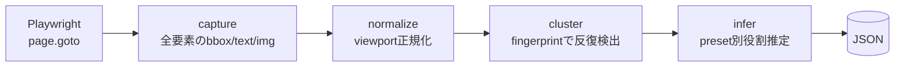

<div align="center">

# geom-scraper

### CSSクラスもXPathも使わない、幾何構造ベースのウェブスクレイパー

[](src/)
[](src/capture.ts)
[](LICENSE)

**画面のレイアウト（要素の位置・サイズ・形状）だけで、繰り返しカードを自動抽出する。**

---

</div>

## 概要

サイトの DOM クラス名は変わるが、**画面上のレイアウトはそう簡単に変わらない**。
geom-scraper は要素の bbox / 文字長 / 画像有無といった**幾何情報だけ**で「カード状の繰り返し構造」を見つけ、その中身を JSON にする。
ショッピングサイトに限らず、ニュース一覧・記事一覧・動画一覧・リポジトリ一覧など、カードの繰り返しがある画面なら何でも対象。

LLM に HTML を丸投げするのと比べて **1/50〜1/100** にトークンを圧縮できる。

## 特徴

| 機能 | 内容 |
|---|---|
| クラス/XPath非依存 | 幾何特徴のみで抽出、マークアップ変更に強い |
| 用途を選ばない | ニュース・記事・動画・リポ・SNS・EC など、カードの繰り返しがある画面なら何でも |
| 3プリセット | `generic`(既定) / `shopping` / `raw` |
| stealth 同梱 | `navigator.webdriver` / WebGL / plugins 等を偽装、主要サイトのbot検知も通過 |
| 自動グルーピング | カード数 × 平均面積 × 画像比率 × テキスト比率 でメインリストを自動選択 |
| URL絶対化 | `srcset` / `data-src` / 相対パスを全部絶対URLに解決 |
| デバッグ支援 | `--debug` でフルページPNG + 生nodes JSON を出力 |

### プリセット別の出力

| preset | 出力スキーマ | 用途 |
|---|---|---|
| `generic` (既定) | `image` / `primaryText` / `secondaryText` / `meta[]` / `links[]` / `url` | ニュース・記事・動画・リポ・SNS など何でも |
| `shopping` | `title` / `price` / `image` / `url` | EC・価格比較（`[¥￥$€£]xxx` / `xxx円` の価格抽出ロジック内蔵、ポイント表記は除外） |
| `raw` | `texts[]` / `images[]` / `links[]` | LLMに整形させる前段の素材出力 |

## 処理フロー



| ステップ | 役割 |
|---|---|
| capture | Playwright で全要素の bbox / text / hasImage / isLink / childTags / parent を取得（stealth init script + lazy画像対策スクロール） |
| normalize | viewport で正規化、aspect ratio / area ratio / log(textLength) を計算 |
| cluster | 同じ親を持つ兄弟群を fingerprint (`tag\|childCount\|imghave\|aspectBucket\|textLenBucket\|childTagsSig`) で集約、score上位を選ぶ |
| infer | preset別ルールで image / primaryText / price / meta などを推定 |

このパイプラインを 4種類のエントリポイントから叩ける:

| エントリ | ファイル | 用途 |
|---|---|---|
| CLI | `src/index.ts` | 手元で叩く / シェルから |
| Node lib | `src/extract.ts` | 他のNode/TSコードから `import` |
| MCP server | `src/mcp.ts` | MCPクライアントから |
| HTTP API | `src/server.ts` | 他言語 / 別マシン / curl |

## インストール

```bash
git clone https://github.com/cUDGk/geom-scraper.git
cd geom-scraper
npm install
npx playwright install chromium
```

> **Linux / Docker (root) で動かす場合**: `GEOM_SCRAPER_NO_SANDBOX=1` を設定すると Chromium が `--no-sandbox` で起動する。サンドボックスを切るのはセキュリティ上の妥協なので、コンテナ内など他の隔離手段がある環境のみで使うこと。

## 使い方

### CLI

```bash
# 既定 (generic preset) — どんなサイトでもまずこれ
npm run scrape -- "https://news.ycombinator.com/" --out output/hn.json
npm run scrape -- "https://github.com/trending/typescript" --out output/gh.json
npm run scrape -- "https://zenn.dev/topics/typescript" --out output/zenn.json

# ショッピングサイト (price フィールドが欲しい場合)
npm run scrape -- "https://jp.mercari.com/search?keyword=switch" --preset shopping

# 素材を全部出して LLM に整形させたい
npm run scrape -- "https://example.com/" --preset raw

# デバッグ（スクショ + 生nodes 出力）
npm run scrape -- "https://example.com/" --debug
```

### CLI オプション

| オプション | 既定 | 説明 |
|---|---|---|
| `--url <url>` | (必須) | スクレイプ対象の URL (位置引数でも可) |
| `--preset shopping\|generic\|raw` | `generic` | 出力スキーマ |
| `--out path` | `output/result.json` | 出力先 |
| `--group N` | 0 | 何番目のカードグループを採用するか |
| `--all-groups` | off | 検出した全グループを返す |
| `--no-stealth` | stealth有効 | stealth init script を切る |
| `--headed` | headless | ブラウザを表示 |
| `--wait ms` | 1500 | スクロール後の追加待ち |
| `--debug` | off | `<name>.png` + `<name>.raw.json` も出す（CLIのみ） |

### Node ライブラリとして

```ts
// ビルド後 (npm run build) は dist/extract.js を使う
import { scrape } from "./dist/extract.js";
// tsx / ts-node で直接実行する場合は ./src/extract.js でも可

const result = await scrape("https://github.com/trending/typescript", {
  preset: "generic",
});
// result.items は ExtractedGeneric[]
```

### MCP サーバとして

stdio で MCP サーバとして起動できる。MCPクライアントから呼び出せる。

```bash
npm run mcp
```

MCPクライアントの設定ファイル (例: `claude_desktop_config.json`) に登録:

```json
{
  "mcpServers": {
    "geom-scraper": {
      "command": "node",
      "args": ["--import", "tsx/esm", "C:/path/to/geom-scraper/src/mcp.ts"]
    }
  }
}
```

> ビルド済みの JS を使う場合は `npm run build` 後に `node C:/path/to/geom-scraper/dist/mcp.js` を `command`/`args` に指定する。`npx -y tsx` を毎回起動するパターンは MCP クライアント側でタイムアウトすることがあるため非推奨。

提供ツール:

| tool | 引数 | 説明 |
|---|---|---|
| `scrape_page` | `url`, `preset`, `group_index`, `all_groups`, `wait_ms` | URL とプリセットを受け取って JSON で返す |
| `list_card_groups` | `url`, `wait_ms` | 全カードグループの fingerprint と件数だけ返す（preset/group_index 調査用） |

### HTTP API として

```bash
npm run server          # 既定 127.0.0.1:8765
PORT=9000 npm run server # ポート指定
HOST=0.0.0.0 npm run server # LAN公開
```

エンドポイント:

| メソッド | パス | 内容 |
|---|---|---|
| GET | `/health` | `{ "ok": true }` |
| GET | `/scrape?url=...&preset=...&group_index=...&all_groups=...&wait_ms=...` | スクレイプ結果JSON |
| POST | `/scrape` (body: `{url, preset, group_index, all_groups, wait_ms}`) | 同上 |

```bash
# GET
curl "http://127.0.0.1:8765/scrape?url=https://news.ycombinator.com/&preset=generic"

# POST
curl -X POST -H "content-type: application/json" \
  -d '{"url":"https://github.com/trending/typescript","preset":"generic"}' \
  http://127.0.0.1:8765/scrape
```

## 実証結果

### generic preset (既定)

| サイト | カテゴリ | カード数 | primaryText | meta | url |
|---|---|---|---|---|---|
| news.ycombinator.com | ニュース掲示板 | 30/30 | 記事タイトル ✓ | 順位 / ドメイン | ✓ |
| zenn.dev/topics/typescript | 技術記事 | 47/47 | 記事タイトル ✓ | 著者 / 投稿時期 / いいね | ✓ |
| youtube.com (検索) | 動画 | 10/10 | 動画/プレイリスト名 ✓ | チャンネル / レッスン数 | ✓ |
| github.com/trending | リポジトリ | 11/11 | リポ名 ✓ | Star / Sponsor等のラベル | ✓ |

### shopping preset

| サイト | カード数 | title | price | image | url |
|---|---|---|---|---|---|
| books.toscrape.com | 20/20 | ✓ | £51.77 | ✓ | ✓ |
| jp.mercari.com (検索) | 34/34 | ✓ | ¥2,600 | ✓ webp | ✓ |
| shopping.yahoo.co.jp | 40/40 | ◎ (一部店名混じる) | 1,100円 | ✓ | ✓ |
| amazon.co.jp (検索) | 55/55 | ✓ | ￥29,800 | ✓ | ✓ (sspaリダイレクト経由) |

## トークン節約効果

LLM に HTML を丸投げするのと比べて約50〜100倍圧縮できる。

| サイト/対象 | 生HTMLのトークン (概算) | geom-scraper JSON | 圧縮率 |
|---|---|---|---|
| GitHub Trending (TS) — 11リポ | 約 10〜15万 | 約 2〜3千 | ~50x |
| Hacker News フロントページ — 30件 | 約 5〜8万 | 約 1.5〜2千 | ~40x |
| Zenn topic ページ — 47記事 | 約 20〜30万 | 約 4〜5千 | ~60x |
| Amazon JP 検索結果 — 55商品 | 約 40〜80万 | 約 8千 | ~70x |

ハイブリッドの推奨パターンは「**ルール抽出で90%、ノイズが残った数件だけ LLM に投げて補正/分類**」。
特にエージェント系プロダクトでブラウジング → 集計したい場合に効く。

## セキュリティ

### 環境変数

| 変数 | 既定 | 説明 |
|---|---|---|
| `GEOM_SCRAPER_API_TOKEN` | (未設定) | HTTP API の Bearer トークン認証。設定時は `Authorization: Bearer <token>` ヘッダーが必須 |
| `GEOM_SCRAPER_MAX_CONCURRENT` | `3` | HTTP API の同時リクエスト上限。超過は 429 を返す |
| `GEOM_SCRAPER_CORS_ORIGIN` | (未設定) | CORS で許可するオリジン (例: `https://example.com`)。未設定時は CORS ヘッダーなし（同一オリジン保護） |
| `GEOM_SCRAPER_ALLOW_PRIVATE` | (未設定) | `1` を設定すると RFC1918/ループバック/リンクローカルへのリクエストを許可（Docker 内部ネット等） |
| `GEOM_SCRAPER_NO_SANDBOX` | (未設定) | `1` を設定すると Chromium の `--no-sandbox` を有効化（Docker root 環境向け） |
| `GEOM_SCRAPER_SCRAPE_TIMEOUT_MS` | `60000` | HTTP API の1リクエストあたりの最大処理時間（ミリ秒）。超過は 504 を返す |
| `GEOM_SCRAPER_OUTPUT_ROOT` | `<cwd>/output` | `screenshotPath` / `rawNodesPath` の出力先ルート。このディレクトリ外へのパスは拒否される |

### SSRF 対策

デフォルトでは `http:` / `https:` 以外のスキームおよびプライベートアドレス (`10.x`, `172.16-31.x`, `192.168.x`, `127.x`, `::1` 等) へのリクエストはブロックされる。
`GEOM_SCRAPER_ALLOW_PRIVATE=1` で解除できるが、信頼できる環境のみで使用すること。

### `screenshotPath` / `rawNodesPath`

これらのオプションは **CLI (`--debug`) のみ**で使用される内部デバッグ用。HTTP API と MCP の入力からは除外されている。

## 制約

- 動的ロード（無限スクロール 2画面目以降）は未対応
- ログイン必須サイトは未対応
- `iframe` 内は対象外
- カードが複数行 (`<tr>` を2行で1記事 等) に跨る構造は片側しか拾わない (HN例)
- ルールベース推定なので 1〜2件のノイズは残る — 完璧にしたい場合は `--preset raw` で素材出力して LLM に整形させる

## ライセンス

[MIT License](LICENSE) — Copyright (c) 2026 cUDGk
